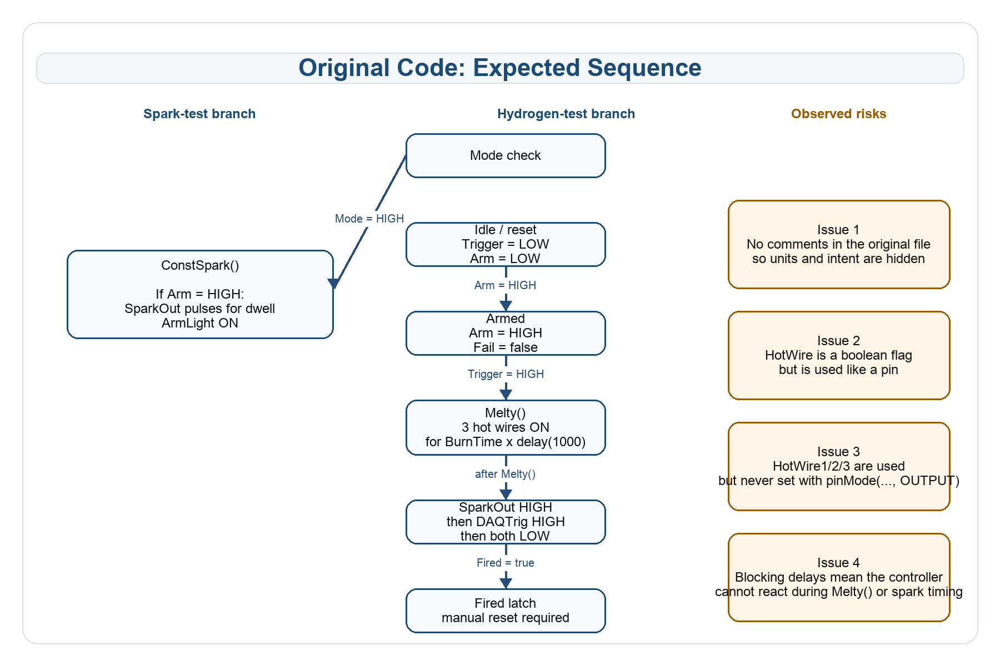

# Original Trigger Box Code

Code review summary of the original M-Duino sketch, including the expected sequence, missing comments, hidden units, and potential technical issues.

## 1. Why This Document Exists

The original trigger-box sketch is short, but the short length hides several important assumptions.

- The file contains almost no comments.
- Variable names do not show their units.
- At least one boolean flag is used as if it were a hardware pin.
- The firing sequence must be inferred by reading the code carefully.

This document explains what the original code appears to do, where the main risks are, and why the later rewritten version is easier to understand and debug.

## 2. Code File Covered Here

- `M-DuinoScripts/M-Duino_Original/M-Duino_Original.ino`

Important note:

- This document describes the original sketch only.
- It does not describe the later cleaned state-machine review path that currently reaches `M_Duino_v005.ino`.
- The original `.ino` file is the source of truth for the baseline implementation discussed here.

## 3. Relationship to the Later Reviewed Version

This document describes the original baseline code that was later improved in the reviewed firmware.

The current reviewed production version is:

- `M-DuinoScripts/M_Duino_v005/M_Duino_v005.ino`

So the intended interpretation is:

- this document explains the original implementation and its risks
- the reviewed controller document explains the later improved version
- the two documents should not be treated as describing the same firmware file

## 4. What the Original Code Appears to Do

The original sketch has two operating modes:

- `Mode = HIGH`
  Spark-test mode using `ConstSpark()`
- `Mode = LOW`
  Hydrogen-test mode using `HydrogenTest()`

In hydrogen-test mode, the code appears intended to do the following:

1. Wait for a valid arming condition.
2. Reject the sequence if `Trigger` is pressed before `Arm`.
3. Activate the hot-wire outputs for a period of time.
4. Fire the spark output.
5. Raise the DAQ trigger near the end of the spark pulse.
6. Latch the system as fired until the operator resets it.

The intended sequence is not explained in the original file itself, so the diagram below summarizes the behavior the code seems to be aiming for.

## 5. Expected Sequence from the Original Logic



Figure 1. Expected sequence and major risks in the original sketch.

## 6. Missing Comments and Hidden Assumptions

The original file has almost no explanatory comments. That creates several problems:

- The operating modes are not described.
- The intended hydrogen-test sequence is not described.
- The code does not explain whether inputs and outputs are active HIGH or active LOW.
- The code does not explain that the hot-wire outputs are expected to command external relays or drivers.
- The reset behavior must be inferred from the logic rather than read from comments.

Because of that, different readers may interpret the same code differently.

## 7. Hidden Time Units in the Original Code

The original code uses plain numbers such as `10`, `5000`, and `600`, but the numbers themselves do not contain any time unit.

The unit comes from the function that uses the value.

Examples:

- `delay(1000)` means `1000 milliseconds`
- `delayMicroseconds(5000)` means `5000 microseconds`

That means the original variables work like this:

| Original variable | Current value | Effective unit | Why |
|---|---|---|---|
| `BurnTime` | `10` | seconds in practice | It is used as the number of repetitions of `delay(1000)`, so the total is `10 x 1 second`. |
| `dwell` | `5000` | microseconds | It is used in `delayMicroseconds(dwell)`. |
| `Delay` | `600` | microseconds | It is used in `delayMicroseconds(Delay)`. |
| `count` | loop counter | no physical unit | It is used only to count the burn loop. |

This is one reason the later cleaned code uses names such as `_us` directly in the variables.

## 8. Main Technical Issues in the Original Sketch

### Issue 1. `HotWire` is a boolean, but it is used like a pin

The original code declares:

```cpp
boolean HotWire = true;
```

But later it uses:

```cpp
pinMode(HotWire, OUTPUT);
digitalWrite(HotWire, LOW);
```

This is a major problem because `HotWire` is not `HotWire1`, `HotWire2`, or `HotWire3`. It is only a true/false flag.

### Issue 2. `HotWire1`, `HotWire2`, and `HotWire3` are used but not configured as outputs

The function `Melty()` writes to:

- `HotWire1`
- `HotWire2`
- `HotWire3`

But `setup()` does not call:

```cpp
pinMode(HotWire1, OUTPUT);
pinMode(HotWire2, OUTPUT);
pinMode(HotWire3, OUTPUT);
```

That makes the output configuration incomplete.

### Issue 3. The code uses blocking delays

The original code blocks inside:

- `Melty()`
- `ConstSpark()`
- the spark/DAQ firing block

This means the controller cannot react during those delays. For example, it cannot check for an abort condition while the hot-wire step is running.

### Issue 4. The sequence is controlled by interacting flags instead of explicit states

The original code mixes:

- `Armed`
- `Fail`
- `Fired`
- `flag`

This is workable for a prototype, but it makes debugging much harder because the operator cannot easily tell which phase the controller is actually in.

### Issue 5. The serial output is very limited

The original code prints compact raw values, but it does not print readable messages such as:

- `ARMED`
- `MELTING`
- `FIRED`
- `FAIL`

So even if the sketch is running, the operator cannot easily see the sequence in words.

## 9. Original Hydrogen-Test Logic in Words

This is the expected reading of `HydrogenTest()`:

1. If both `Trigger` and `Arm` are LOW, the code clears `Fired` and `Fail`.
2. If `Trigger` is HIGH while `Arm` is LOW, the code sets `Fail = true`.
3. If `Fail == false`, `Arm == HIGH`, and `Fired == false`, the code sets `Armed = true` and turns on the arm light.
4. If `Trigger == HIGH` while `Armed == true` and `Fired == false`, the code enters the firing block.
5. If `HotWire == true`, it calls `Melty()`.
6. `Melty()` turns on the three hot-wire outputs and waits for `BurnTime` cycles of `delay(1000)`.
7. After `Melty()`, the code turns `SparkOut` on.
8. It waits for `dwell - Delay` microseconds.
9. It turns `DAQTrig` on.
10. It waits for `Delay` microseconds.
11. It turns both `SparkOut` and `DAQTrig` off.
12. It sets `Fired = true` and uses `flag` as an additional latch.
13. The system stays latched until both `Arm` and `Trigger` are released.

## 10. Why the Original File Is Hard to Debug

The original file is hard to debug for several reasons:

- There is no explicit state machine.
- There are no descriptive state names.
- Units are hidden.
- The hot-wire phase blocks execution for a long time.
- Serial output does not describe transitions in clear engineering terms.
- The intended sequence is not written down in comments.

So when something goes wrong, it is difficult to answer questions like:

- Did the code fail before arming?
- Is it still inside `Melty()`?
- Has it already fired?
- Is it waiting for reset?

## 11. Safety Concerns Specific to the Original Code

- The file assumes external safety hardware exists.
- The code does not clearly document safe reset conditions.
- The code cannot respond quickly during long blocking delays.
- The hot-wire flag/pin confusion is especially risky in hardware-control code.
- The file does not clearly describe what should happen if `Arm` is released during a hazardous phase.

## 12. Short Summary

The original code appears to be a compact prototype of the desired trigger-box behavior, but it is not well documented and it contains several important implementation risks.

The biggest concerns are:

- no comments explaining intent
- hidden time units
- blocking delays
- weak debug visibility
- `HotWire` being used like a pin even though it is only a boolean flag

So the original sketch can be read as an early working concept, but it is not a clear or low-risk final implementation.
