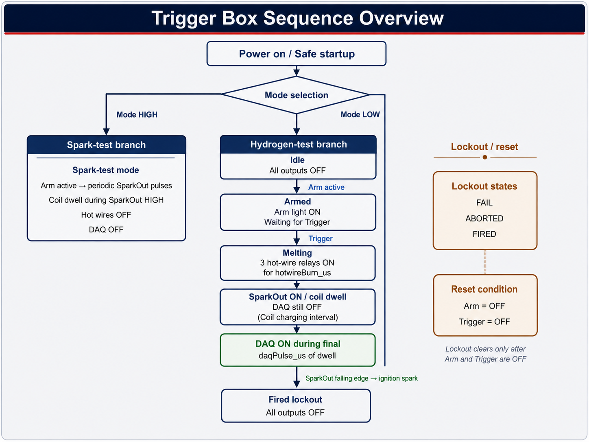

# Trigger Box Controller

Code review summary of the reviewed M-Duino control logic for operator understanding, peer review, and lab handover.

## 1. Purpose

This controller manages a trigger box with two operating modes:

- `Spark-test mode`
- `Hydrogen-test mode`

In hydrogen-test mode, the controller enforces a defined sequence:

1. The operator arms the system.
2. The operator presses `Trigger`.
3. The three hot-wire relay outputs turn on for a fixed time.
4. The ignition command output turns on and the coil dwell interval begins.
5. The DAQ trigger turns on near the end of the dwell interval.
6. All outputs turn off.
7. If the ignition system fires on coil collapse, the physical spark is released when the dwell signal goes low.
8. The system remains locked out until both `Arm` and `Trigger` are released.

The revised code is longer than the original because it makes the sequence explicit and easier to audit. Instead of relying on several interacting flags, it uses a named state machine.

## 2. Firmware Source Referenced

This explanation refers to the following source files in the repository:

- `M-DuinoScripts/M_Duino_v005/M_Duino_v005.ino`
- `M-DuinoScripts/M-Duino_Original/M-Duino_Original.ino`

Interpretation rule:

- the `.ino` files are the source of truth for the actual firmware logic
- this document explains the logic and terminology, but does not replace the source code itself

## 3. Hardware Signals

| Signal                                   | Type            | Purpose            | Meaning in the logic                                                            |
| ---------------------------------------- | --------------- | ------------------ | ------------------------------------------------------------------------------- |
| `Arm`                                  | Digital input   | Both modes         | Allows the system to arm. Must remain active during hazardous phases.           |
| `Trigger`                              | Digital input   | Hydrogen-test mode | Starts the firing sequence after arming. On the real box this may be a maintained switch rather than a momentary pushbutton. In hydrogen-test mode it must be returned to the inactive position before the next clean re-arm.  |
| `Mode`                                 | Digital input   | Both modes         | Selects `Spark-test` or `Hydrogen-test` behavior.                           |
| `ArmLight`                             | Digital output  | Both modes         | Indicates that the system is armed or in an active sequence. In hydrogen-test mode, the light staying off while `Trigger` remains active after a fired/fail/abort condition is intentional feedback that a clean reset has not yet been completed. In spark-test mode, the light follows `Arm` more directly.                    |
| `HotWire1`, `HotWire2`, `HotWire3` | Digital outputs | Hydrogen-test mode | Drive the three relay channels that control the external hot-wire power system. |
| `SparkOut`                             | Digital output  | Both modes         | Commands the ignition stage. In a coil-based setup, this typically defines the dwell / coil-charge interval rather than the exact physical spark duration. |
| `DAQTrig`                              | Digital output  | Hydrogen-test mode | Sends a timing pulse to the data-acquisition system.                            |

## 4. Unit Convention

The code uses explicit units where they matter.

- Any variable ending in `_us` is in `microseconds`.
- Pins, booleans, and states do not have physical units, so they do not get a unit suffix.

Examples:

- `hotWireBurn_us`
- `sparkDwell_us`
- `daqPulse_us`
- `sparkTestInterval_us`
- `debounce_us`
- `lastSerialPrint_us`
- `meltStart_us`
- `sparkStart_us`

This naming style makes the timing easier to understand and reduces mistakes when adjusting values.

### Why the reviewed script is better than the original on units

The reviewed `M_Duino_v005.ino` is better than the original sketch in how it handles units.

The original code used shorter names such as:

- `dwell`
- `Delay`

Those names are compact, but they are much easier to misunderstand because the unit and physical meaning are not visible at the point of use.

The reviewed code is clearer because names such as:

- `sparkDwell_us`
- `daqPulse_us`
- `hotWireBurn_us`

make the time unit explicit.

This improves:

- code readability
- auditability
- discussion with colleagues
- safety when changing timing values

Important nuance:

- `M_Duino_v005.ino` is clearly better on unit clarity
- but a few names still need physical interpretation in the documentation
- the main example is `sparkDwell_us`, which should be understood as coil dwell / ignition-command time, not literal plasma duration at the spark plug

## 5. Main Timing Variables

| Variable                   | Current value  | Unit         | Meaning                                                       |
| -------------------------- | -------------- | ------------ | ------------------------------------------------------------- |
| `hotWireBurn_us`         | `10,000,000` | microseconds | Keeps the three hot-wire relay outputs on for 10 seconds.     |
| `sparkDwell_us`          | `5,000`      | microseconds | Coil dwell / ignition-command duration before release. In a coil-based system, the physical spark is typically produced when this command goes low. |
| `daqPulse_us`            | `600`        | microseconds | Width of the DAQ trigger pulse during the final part of the dwell interval. |
| `sparkTestInterval_us`   | `500,000`    | microseconds | Time between ignition-command cycles in spark-test mode. |
| `sparkTestMaxRun_us`     | `30,000,000` | microseconds | Maximum continuous spark-test run time before the controller stops spark-test automatically as a safety timeout. |
| `debounce_us`            | `30,000`     | microseconds | Stable input time required before accepting a switch change. This can introduce up to about `30 ms` of input acceptance delay for a changed switch state. |
| `serialPrintInterval_us` | `250,000`    | microseconds | Limits how often the serial monitor is updated.               |

### Debounce interpretation

The debounce setting is often misunderstood, so it is useful to state it explicitly:

- `debounce_us = 30,000` means the firmware waits for the raw input to remain unchanged for about `30 ms` before accepting the new state.
- This can introduce up to about `30 ms` of input acceptance delay after a switch changes.
- That delay is intentional. It helps reject mechanical switch bounce and short noise spikes.
- It does **not** mean the whole controller is delayed by `30 ms` all the time. It only affects recognition of a changed input state.

The software method used here is:

- if the raw input changes, the debounce timer effectively restarts
- only when the raw level stays unchanged for the full debounce interval does the firmware update the accepted stable state

This is a common and robust debounce approach for mechanical operator controls such as `Arm`, `Trigger`, and `Mode`.

### Recommended feature settings for real hazardous tests

For a real hydrogen ignition run, the recommended feature configuration is:

- `useHotWireStep = true`
- `enableSerialDebug = false`
- `enableTransitionDebug = false`
- `useBenchTestTimings = false`

Interpretation:

- `useHotWireStep = true` should remain enabled if the real experiment includes the hot-wire stage before ignition.
- `enableSerialDebug = false` is recommended for real firing because serial printing at `9600` baud can interfere with short timing windows such as `sparkDwell_us = 5000` and `daqPulse_us = 600`.
- `enableTransitionDebug = false` should also be disabled for the same reason.
- `useBenchTestTimings = false` keeps the real timing values instead of the shortened bench/simulator values.

For bench testing, dry checks, and Wokwi-style logic validation, it is still reasonable to use debug output and shortened timings when needed.

### DAQ output path note

The `DAQTrig` pulse is intentionally short. In the reviewed configuration it is only `600 us`, so the real DAQ trigger path should be verified as a **fast electronic output path**, not a mechanical relay path.

The practical hardware check is:

- confirm that the DAQ trigger is driven from the intended `Q` output path
- confirm that the signal is not later routed through a slow relay or bouncing contact
- confirm on an oscilloscope that the real pulse width and edge timing are acceptable at the DAQ input

## 6. Sequence Overview

Figure 1. Trigger box sequence overview.

Important interpretation note:

- The controller diagram is correct at the `SparkOut` command level.
- In a coil-based ignition system, the physical spark event is typically associated with the falling edge of `SparkOut`, not the moment `SparkOut` first goes high.
- This means the diagram should be read as a controller-sequence diagram, not as a literal plasma-duration diagram.

### Hydrogen-test mode

1. The controller starts in `stateIdle` with all outputs off.
2. If `Trigger` is already active before proper arming, the controller enters `stateFail`.
3. When `Arm` becomes active, the controller enters `stateArmed`.
4. When `Trigger` is pressed, the controller starts the hot-wire stage if `useHotWireStep = true`.
5. In `stateMelting`, all three hot-wire relay outputs stay on for `hotWireBurn_us`.
6. After that delay, the hot-wire outputs turn off and the ignition command stage begins.
7. In `stateSparkWaitDaq`, `SparkOut` is on and `DAQTrig` is still off.
8. In a coil-based system, this interval is the coil dwell / coil-charge interval.
9. After `sparkDwell_us - daqPulse_us`, the controller turns `DAQTrig` on.
10. At the end of `sparkDwell_us`, the controller turns both `SparkOut` and `DAQTrig` off.
11. If the ignition system fires on coil collapse, the physical spark is released at or immediately after this falling edge.
12. The controller enters `stateFired`.
13. The system remains locked out until both `Arm` and `Trigger` are released.

### Operator reset behavior

If the real `Trigger` control is a maintained switch rather than a momentary pushbutton, the reset/re-arm sequence is intentionally strict:

- after a fired, failed, or aborted cycle, both `Arm` and `Trigger` must be returned to the inactive position
- if `Trigger` remains active, the controller will not return to a clean ready state
- the `ArmLight` remaining off in that condition is intentional feedback to the operator

So in practical operator terms, the next hydrogen-test cycle should follow this sequence:

1. `Arm OFF`
2. `Trigger OFF`
3. `Arm ON`
4. `Trigger ON` to start the next run

### Spark-test mode

- The hot-wire outputs stay off.
- The DAQ output stays off.
- If `Arm` is active, the controller allows repeating ignition-command cycles after spark-test has been enabled.
- In the reviewed `v005` logic, `Trigger` acts as a toggle command:
  - the first clean activation starts repeating spark-test pulses
  - the next clean activation stops spark-test
- If spark-test is left running, the controller also stops it automatically after `sparkTestMaxRun_us = 30 s`.
- If `Arm` is released, the controller turns the spark output off immediately.
- In spark-test mode, `ArmLight` follows the arm condition more directly and does not use the same strict trigger-reset rule as the hydrogen branch.
- So if `Arm` is active, the armed indication can be on whether `Trigger` is currently active or inactive.

## 7. State Machine

The reviewed version uses a state machine instead of several loosely connected flags.

| State                 | Meaning                                                                                 |
| --------------------- | --------------------------------------------------------------------------------------- |
| `stateIdle`         | Safe waiting state with all outputs off.                                                |
| `stateArmed`        | Arm is active and the controller is waiting for Trigger.                                |
| `stateMelting`      | The three hot-wire relay outputs are energized.                                         |
| `stateSparkWaitDaq` | `SparkOut` is active and the controller is waiting for the DAQ start point. In a coil-based system, this corresponds to the dwell / charge interval. |
| `stateSparkWaitEnd` | `SparkOut` and `DAQTrig` are active and the controller is waiting for the end of the dwell interval. |
| `stateFired`        | The sequence completed successfully. Reset is required before a new cycle.              |
| `stateFail`         | An invalid start condition occurred, such as Trigger being active before proper arming. |
| `stateAborted`      | The sequence was interrupted because Arm was released during a hazardous phase.         |

## 8. Why This Version Is Safer and Easier to Read

Compared with the original short sketch, the reviewed version improves several important points:

- The hot-wire relay outputs are clearly separated from boolean flags.
- Timing variables include units in their names.
- The main sequence is explicit and easier to follow.
- Lockout behavior is deliberate rather than accidental.
- Unsafe transitions such as releasing `Arm` during the hot-wire or spark phase are handled immediately.
- Spark-test now has a defined automatic stop after `30 s`, which reduces the risk of leaving the ignition test running unintentionally.
- Mode changes force the controller back to a safe state.

## 9. Code Structure

| Function or block            | Role                                                                                           |
| ---------------------------- | ---------------------------------------------------------------------------------------------- |
| `setup()`                  | Configures inputs and outputs, starts serial communication, and forces a safe startup state.   |
| `loop()`                   | Updates inputs, checks for mode changes, runs the appropriate mode handler, and prints status. |
| `DebouncedInput`           | Filters switch bounce so mechanical inputs behave more reliably.                               |
| `handleSparkTestMode()`    | Runs spark-test toggle behavior, repeating ignition-command pulses, immediate stop on `Arm` release, and the `30 s` safety timeout. |
| `handleHydrogenTestMode()` | Runs the main sequence and lockout logic.                                                      |
| `startMeltingOrSpark()`    | Chooses whether to start the hot-wire stage or jump directly to the ignition-command stage.                         |
| `startSparkSequence()`     | Forces hot wires off, starts the ignition-command stage, and begins dwell timing.                         |
| `allOutputsOff()`          | Provides a reusable safe-off command for all outputs.                                          |

## 10. Safety Behaviors Built Into the Logic

- All outputs are forced off at startup.
- All outputs are forced off after firing, failure, abort, or mode change.
- The controller requires `Arm` to remain active during the melting and spark phases.
- The controller requires both `Arm` and `Trigger` to be released before re-arming after a lockout state.
- The hot-wire outputs are turned off before the ignition-command stage begins.
- Spark-test stops automatically after `30 s` if the operator does not stop it first.

Important note:

- This software is not a substitute for a hardwired emergency stop.
- The emergency stop should physically remove power from the hot-wire supply and the spark system.

## 11. Hardware Points to Confirm

Before using the controller on the real setup, two hardware questions should be confirmed:

1. `Relay polarity`
   Some relay modules are active `LOW` rather than active `HIGH`. If the relays energize when the controller output goes low, the output logic in the code must be inverted.
2. `Input wiring`
   The `Arm`, `Trigger`, and `Mode` inputs must be electrically well-defined. If the wiring allows the input to float, the controller can behave unpredictably.

## 12. Practical Test Strategy

Recommended step-by-step validation:

1. Power the M-Duino correctly from its intended external supply.
2. Connect the Mac by USB only for upload and serial monitoring.
3. Test the logic first with the hazardous power stages disconnected.
4. Use the serial monitor to check `Mode`, `Arm`, `Trigger`, and the current state name.
5. Verify relay polarity on each hot-wire channel before connecting the real hot-wire power circuit.
6. Introduce the real hot-wire and spark hardware only after the low-risk logic checks pass.

## 13. Short Summary

This reviewed version keeps the same overall purpose as the original sketch, but it is easier to understand, easier to explain, and easier to review with colleagues. The main improvements are:

- clearer naming
- explicit timing units
- a proper state machine
- deliberate safety and lockout behavior
- a clearer explanation of how hot wires, coil dwell, ignition release, and DAQ interact
- better timing-variable naming and unit visibility than the original sketch
