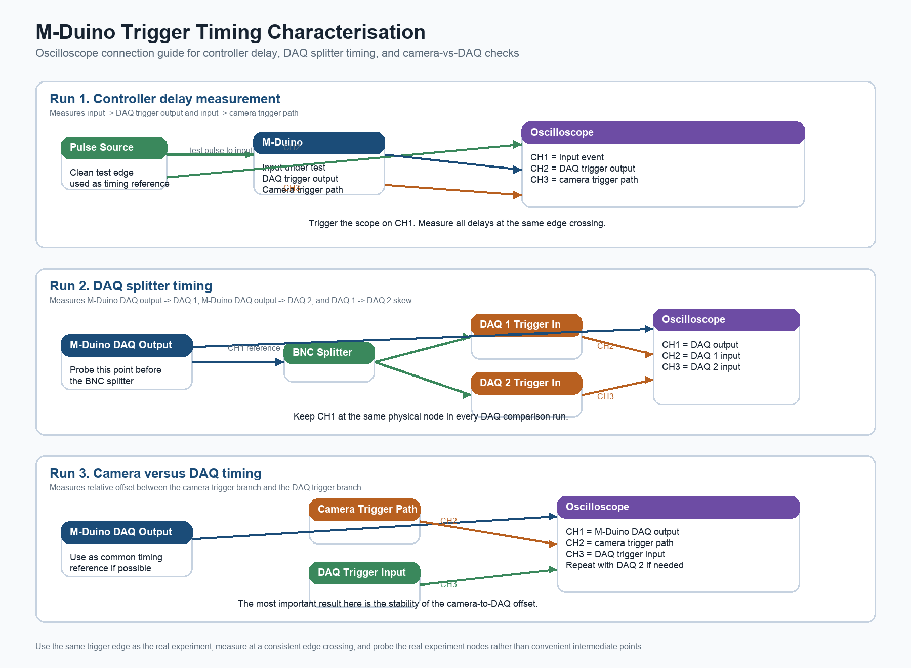

# M-Duino Trigger Timing Characterisation Guide

## Purpose

This guide explains how to measure the timing behaviour of the M-Duino when it is used as a trigger coordinator for a hydrogen deflagration setup.

The objective is to quantify:

- controller delay
- shot-to-shot jitter
- relative synchronisation offsets between the DAQ trigger branch and the camera trigger branch

## Connection Diagram

The figure below shows the recommended oscilloscope hookup logic for the three main measurement runs.

### What the diagram means

- `Run 1` measures how the M-Duino responds to an incoming event.
- `Run 2` checks whether the split DAQ trigger really arrives at DAQ 1 and DAQ 2 with low relative skew.
- `Run 3` compares the camera trigger path against the DAQ trigger path.

The safest way to use this figure is to treat each panel as a separate measurement configuration. Do not try to measure everything at once if doing so makes the probing unclear or unreliable.

## What This Characterisation Is Trying To Prove

The M-Duino is not the final scientific timing reference in this setup. The final scientific time base is provided by the high-speed datalogger.

The main question is therefore:

- does the M-Duino distribute the trigger events with low enough uncertainty for the experiment?

For deflagration work, the important criteria are usually:

- low and stable trigger delay
- low trigger jitter
- low relative skew between systems

## Assumed Trigger Architecture

This guide assumes the following architecture:

1. A clean input event is applied to the M-Duino.
2. The M-Duino produces a DAQ trigger output.
3. That DAQ trigger is split through a BNC splitter to DAQ 1 and DAQ 2.
4. The camera is triggered through its own separate trigger path.
5. Final scientific timestamping is performed by the high-speed datalogger.

So there are two timing branches to characterise:

- `M-Duino -> DAQ trigger output -> BNC splitter -> DAQ 1 / DAQ 2`
- `M-Duino -> camera trigger path -> camera`

## Why Each Measurement Is Needed

### 1. Input to M-Duino DAQ trigger output

This tells you:

- how long the controller takes to react to the input event
- how much that delay varies from shot to shot

### 2. Input to camera trigger path

This tells you:

- how long the controller takes to produce the camera trigger
- whether the camera path behaves differently from the DAQ path

### 3. M-Duino DAQ output to DAQ 1 and DAQ 2 inputs

This tells you:

- what delay is added by the splitter path, cables, or DAQ input stages
- whether the two DAQs truly receive the same trigger at nearly the same time

### 4. Camera trigger path relative to the DAQ trigger path

This tells you:

- whether the camera is offset relative to the DAQs
- whether that offset is stable

A stable fixed offset is usually much easier to handle than a variable one.

## Do You Need Special Benchmark Code?

Not necessarily for the first pass.

For your case, there are two different timing studies:

### Real-system timing study

This uses:

- your real firmware
- your real outputs
- your real DAQ and camera trigger branches
- the oscilloscope

This answers:

- "Is my actual trigger system good enough?"

### Low-level benchmark timing study

This uses:

- special test code such as the kind shown in the Industrial Shields article
- simplified timing loops
- controlled read/write timing checks

This answers:

- "What is the intrinsic M-Duino timing performance under simplified conditions?"

Recommended order:

1. Measure the real system first.
2. Use benchmark code only if:
   - the results are worse than expected
   - you want to separate hardware and firmware contributions
   - you need a deeper technical appendix

## Safety and Measurement Validity

- Perform the test without ignition and without hazardous experiment execution.
- Use a safe, repeatable pulse source.
- Use the same firmware version intended for the experiments.
- Use the same trigger edge that will be used experimentally.
- Keep cable routing and terminations realistic.
- Record all settings carefully.

Very important:

- do not attach oscilloscope grounds carelessly
- only probe nodes that are safe for direct oscilloscope connection
- follow the lab grounding rules
- if there is any doubt about common ground or floating circuits, use the correct differential or isolated measurement method

## Equipment Needed

- M-Duino controller with the intended firmware
- oscilloscope, ideally 4 channels
- suitable probes
- BNC cables
- BNC splitter
- clean pulse source or function generator
- access to:
  - the chosen M-Duino input
  - the M-Duino DAQ trigger output
  - DAQ 1 trigger input
  - DAQ 2 trigger input
  - camera trigger signal or camera trigger input line

## How To Read The Three Diagram Runs

## Run 1. Controller delay measurement

Use this setup to measure:

- `input -> M-Duino DAQ trigger output`
- `input -> camera trigger path`

### Why this run matters

It tells you the controller-side delay and jitter.

### What to connect

- pulse source to the M-Duino input under test
- pulse source also to `CH1`
- M-Duino DAQ trigger output to `CH2`
- camera trigger path to `CH3`

### What to do on the scope

- trigger the scope on `CH1`
- measure the delay from `CH1` to `CH2`
- measure the delay from `CH1` to `CH3`
- repeat over many shots

## Run 2. DAQ splitter timing

Use this setup to measure:

- `M-Duino DAQ output -> DAQ 1 input`
- `M-Duino DAQ output -> DAQ 2 input`
- `DAQ 1 input -> DAQ 2 input`

### Why this run matters

It tells you whether the two DAQ branches are truly synchronised after the splitter.

### What to connect

- M-Duino DAQ trigger output before the splitter to `CH1`
- DAQ 1 trigger input to `CH2`
- DAQ 2 trigger input to `CH3`

### What to do on the scope

- trigger on `CH1`
- measure the delay from `CH1` to `CH2`
- measure the delay from `CH1` to `CH3`
- measure the relative skew between `CH2` and `CH3`

## Run 3. Camera versus DAQ timing

Use this setup to measure:

- `camera trigger path -> DAQ trigger path`

### Why this run matters

The camera does not share the same split BNC branch as the DAQs, so its relative timing has to be checked separately.

### What to connect

- M-Duino DAQ trigger output to `CH1`
- camera trigger path to `CH2`
- DAQ trigger input to `CH3`

### What to do on the scope

- trigger on `CH1`
- measure `CH2` relative to `CH3`
- repeat for many shots
- repeat with the second DAQ input if needed

## Exactly What To Measure On The Oscilloscope

Use the same edge definition everywhere.

Best practice:

- use the real experimental trigger edge
- measure timing at the `50% amplitude crossing`

Why:

- it gives a consistent reference point
- it avoids ambiguity from slightly different edge shapes

If automatic delay measurement is available, use it. Otherwise:

- place the time cursors at the `50%` crossing points
- use the same method for all signals

## Key Timing Quantities

- `t_input_to_daq = t(DAQ trigger output) - t(input event)`
- `t_input_to_camera = t(camera trigger path) - t(input event)`
- `t_daq1 = t(DAQ 1 trigger input) - t(M-Duino DAQ output)`
- `t_daq2 = t(DAQ 2 trigger input) - t(M-Duino DAQ output)`
- `skew_daq = t(DAQ 1 trigger input) - t(DAQ 2 trigger input)`
- `skew_cam_daq1 = t(camera trigger path) - t(DAQ 1 trigger input)`
- `skew_cam_daq2 = t(camera trigger path) - t(DAQ 2 trigger input)`

## Recommended Scope Configuration

- trigger on the input event for controller-delay measurements
- trigger on the M-Duino DAQ output for branch comparison measurements
- use appropriate vertical scale for the logic level
- use enough time resolution to see the edges cleanly
- use repeated acquisitions or statistics mode for jitter measurements
- start with single acquisitions to confirm polarity and signal order

Record:

- oscilloscope model
- probe type
- sample rate
- bandwidth setting
- trigger source
- trigger edge
- firmware version
- experiment mode
- cable lengths if relevant

## Step-By-Step Measurement Procedure

### Part A. Validate the bench setup

1. Confirm that the pulse source produces a clean and repeatable edge.
2. Confirm that the pulse reaches the intended M-Duino input.
3. Confirm that the M-Duino produces the expected trigger outputs.
4. Confirm that the DAQ trigger line and camera trigger line are correctly identified.

### Part B. Measure controller delay

1. Connect the pulse source to the chosen M-Duino input.
2. Probe the input event on `CH1`.
3. Probe the M-Duino DAQ trigger output on `CH2`.
4. Probe the camera trigger path on `CH3`.
5. Trigger the scope on the input event.
6. Measure:
   - `input -> DAQ trigger output`
   - `input -> camera trigger path`
7. Repeat for at least `100` shots.
8. Prefer `500` to `1000` shots if possible.

### Part C. Measure DAQ splitter timing

1. Probe the M-Duino DAQ trigger output before the splitter on `CH1`.
2. Probe DAQ 1 trigger input on `CH2`.
3. Probe DAQ 2 trigger input on `CH3`.
4. Trigger on `CH1`.
5. Measure:
   - `DAQ output -> DAQ 1 input`
   - `DAQ output -> DAQ 2 input`
   - `DAQ 1 input -> DAQ 2 input`
6. Repeat for many shots and record statistics.

### Part D. Measure camera versus DAQ timing

1. Keep the M-Duino DAQ trigger output as the common reference.
2. Probe the camera trigger path.
3. Probe at least one DAQ input.
4. Measure the relative delay between the camera path and the DAQ path.
5. Repeat for many shots.
6. If needed, repeat with the second DAQ input.

## How To Decide If The Measurement Is Valid

The measurement is more likely to be valid if:

- the signals are clean and repeatable
- the same edge definition is used everywhere
- the same reference channel is kept across repeated runs
- the same firmware and mode are used throughout
- the probed points are the real experiment nodes

The measurement is suspect if:

- the edges are noisy or badly rounded
- the wrong trigger edge is used
- the reference channel changes between runs without documentation
- convenient intermediate points are probed instead of the real nodes
- the wiring differs from the real experiment setup

## Common Mistakes To Avoid

- measuring the wrong edge
- measuring before the real output stage instead of the actual output node
- measuring only one DAQ branch and assuming the second one is identical
- forgetting that the camera is on a different trigger path
- changing firmware during the test campaign
- using arbitrary cursor points instead of a consistent crossing definition
- failing to record which physical node was probed

## Statistics To Record

For each measured quantity, record:

- mean delay
- minimum delay
- maximum delay
- standard deviation
- peak-to-peak jitter
- number of repetitions

## Recommended Results Table

| Path | Mean delay | Min | Max | Std dev | Peak-to-peak jitter | Repetitions | Notes |
|---|---:|---:|---:|---:|---:|---:|---|
| Input -> M-Duino DAQ output |  |  |  |  |  |  | |
| Input -> M-Duino camera trigger path |  |  |  |  |  |  | |
| M-Duino DAQ output -> DAQ 1 input |  |  |  |  |  |  | |
| M-Duino DAQ output -> DAQ 2 input |  |  |  |  |  |  | |
| DAQ 1 input -> DAQ 2 input |  |  |  |  |  |  | Relative skew |
| Camera trigger path -> DAQ 1 input |  |  |  |  |  |  | Relative skew |
| Camera trigger path -> DAQ 2 input |  |  |  |  |  |  | Relative skew |

## Timing Budget Interpretation

For your application, the M-Duino is mainly a coordination layer, not the final scientific time base.

So the timing budget should focus on:

- delay stability
- jitter
- relative branch skew

Practical approximation:

`Total synchronisation uncertainty ~= controller jitter + branch skew + device trigger-response jitter`

For deflagration work, a stable fixed offset is often much less problematic than variable shot-to-shot offset.

## Suggested Acceptance Logic

The system can usually be considered acceptable for deflagration synchronisation if:

- DAQ 1 and DAQ 2 receive the split trigger with negligible relative skew for the intended experiment
- the camera path has a stable offset relative to the DAQ path
- M-Duino-trigger jitter is small compared with the required timing precision
- the total uncertainty is small relative to the characteristic deflagration timescales of interest

## Test Record Template

### Test metadata

- Date:
- Operator:
- Firmware version:
- M-Duino mode:
- Input channel used:
- DAQ trigger output used:
- Camera trigger path:
- Oscilloscope model:
- Probe type:
- Trigger edge:
- Sample rate:
- Repetitions:

### Observations

- Signal quality:
- Missed triggers:
- Inconsistent edges:
- Cable and termination notes:
- Any difference from the real experiment wiring:

### Summary judgement

- Is the DAQ splitter path sufficiently aligned?
- Is the camera path offset stable?
- Is the measured jitter acceptable for the intended deflagration work?
- Is special benchmark firmware needed, or is the real-system measurement already sufficient?
